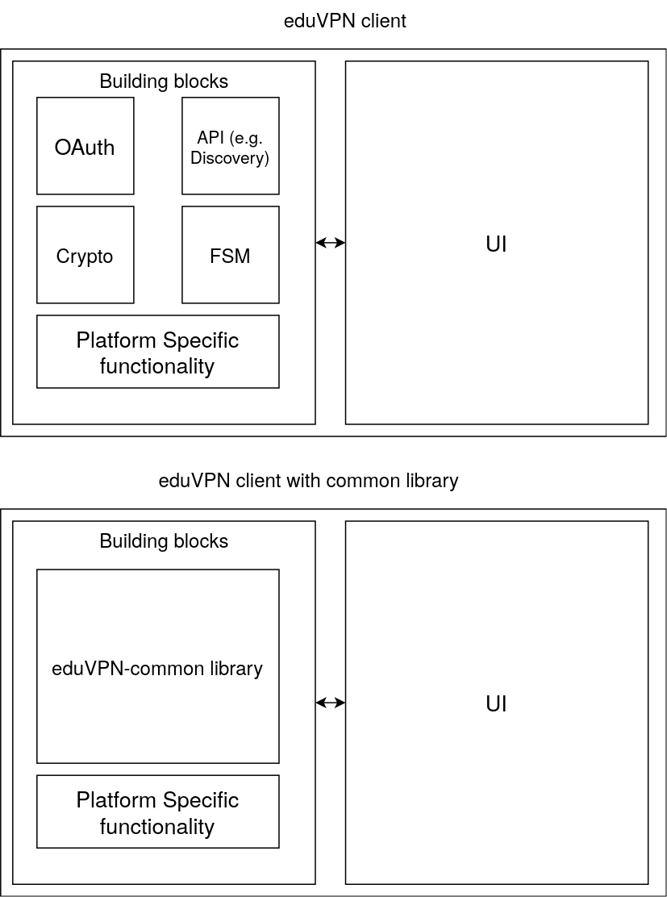

# About
This chapter contains background information for the library. We give a general introduction to eduVPN and explain what problems this library aims to solve.

## EduVPN introduction
eduVPN-common is a library for [eduVPN](https://www.eduvpn.org/), which is a VPN by [SURF](https://www.surf.nl) and a project by [GÉANT](https://geant.org/), for research institutes and universities. Each institute that uses eduVPN has its own server. To discover these servers and establish a VPN connection with them, eduVPN clients are used. eduVPN has clients for each common platform:
- [Android](https://github.com/eduvpn/android)
- [Linux](https://github.com/eduvpn/python-eduvpn-client)
- [MacOS/iOS](https://github.com/eduvpn/apple)
- [Windows](https://github.com/Amebis/eduVPN)

## The problem
However, as these clients are rather similar in functionality, apart from platform specific differences, right now there is duplicate code between them. For example, the process to discover institution's servers, the authorization process (OAuth) and Wireguard key generation.
This goal of this library is to provide the common functionality between these clients into one codebase. The library is written in the [Go](https://go.dev/) language and aims to have wrapper code for each of the languages that are used by the current clients. 

The main goal is thus the following:

This library tries to remove non-platform specific common functionality. This way eduVPN clients have less duplicate code. The building blocks that are removed by the library is not just the four depicted in this figure. You can think of other building blocks, such as logging and local configuration file saving. As can be seen in the figure, no User Interface (UI) code will be implemented. This is left to the eduVPN clients, on top of platform-specific code.

## License
[MIT](https://github.com/jwijenbergh/eduvpn-common/blob/main/LICENSE)

## Authors
This library is written by [Steven Wallis de Vries](https://github.com/stevenwdv) and [Jeroen Wijenbergh](https://github.com/jwijenbergh) at the [SURF](https://www.surf.nl/) and [GÉANT](https://geant.org/) organization.
