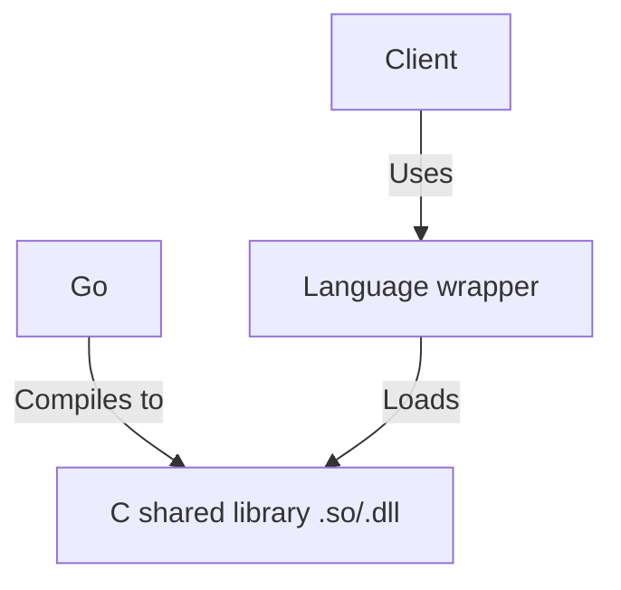

# Architecture
In the previous section, we have already hinted a bit on the exact architecture. This section will expand upon it by giving a figure of the basic structure

As can be seen by this architecture, there is an intermediate layer between the client and the *shared* library. This wrapper eases the way of loading this library and then defining a more language specific API for it. In the eduvpn-common repo, we currently only support a Python wrapper. Clients themselves can define their own wrapper
