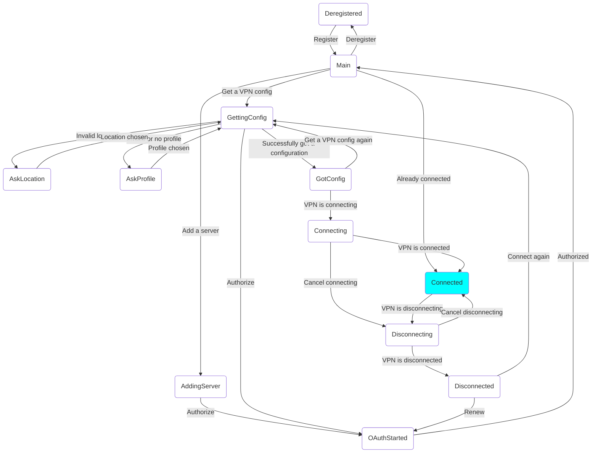

# Current breaking changes

This doc explains breaking changes that are not in clients yet.

## State machine

The state machine has been simplified and some states have been remove or renamed

Renamed:
No Server -> Main

Removed:
- Chosen location
- Chosen profile
- Loading server
- Authorized

Added:
- Adding server
- Getting config
- Disconnected

The new FSM is:

## API

The SetSecureLocation function now requires you to pass the organization id. Additionally, you can no longer pass a cookie to this function.

### Tokens

Renamed the `expires_in` field to `expires_at`

### Profiles
- Removed the list of protocols for each profile that is returned

### Token Setter/Getter
- The first argument of the server JSON has been replaced with two arguments: the server identifier (a string), and the server type (integer, unknown=0, institute access=1, secure internet=2, custom=3)

## Additional

## WireGuard over HTTP
We return a proxy with the source port, listen port and peer when getting a configuration. Pass these arguments to StartProxyguard. The client has to ensure that the traffic coming out of the proxy is going outside of the VPN. This can be done by using the source port and the peer destination as an exclusion. This function also takes a callback as last argument, set to nil/None or put a value here to do something with the underlying socket FD, e.g. on android you can use this to also exclude routing traffic: https://developer.android.com/reference/android/net/VpnService#protect(int).

## Failover
The configuration now returns a should_failover boolean that indicates whether or not failover should be started. The client should only failover when this boolean is true.

## Internal changes

- Moved from internal OAuth implementation to https://github.com/jwijenbergh/eduoauth-go
- Created a new state file (version 2, v2), however, common migrates from v1 to v2 automatically
- add a WireGuard ini parser
- refactor `internal/server` package
- split api into separate package and refactor using the new OAuth implementation into `internal/api`
- removed go-errors/errors
