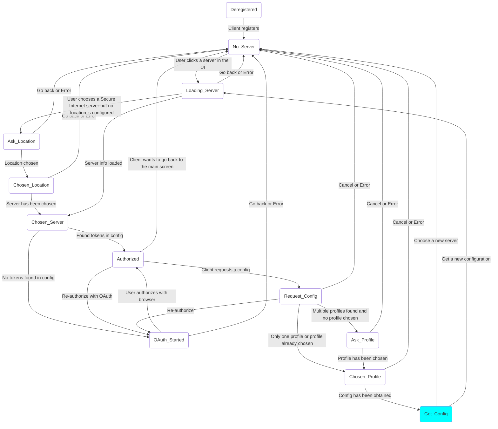

# Finite state machine

The eduvpn-common library uses a finite state machine internally to keep track of which state the client is in and to communicate data callbacks (e.g. to communicate the Authorization URL in the OAuth process to the client).

## Viewing the FSM
To view the FSM in an image, register to the library with in debug mode. This
outputs the graph with a `.graph` extension in the client-specified
config directory. The format of this
graph is from [Mermaid](https://mermaid-js.github.io/mermaid/#/). You
can convert this to an image using the [Mermaid command-line client](https://github.com/mermaid-js/mermaid-cli) installed or from the Mermaid web site, the [Mermaid Live Editor](https://mermaid.live)

## FSM example
The following is an example of the FSM when the client has obtained a Wireguard/OpenVPN configuration from an eduVPN server

The current state is highlighted in the cyan color.

## State explanation

For the explanation of what all the different states mean, see the [client documentation](https://github.com/eduvpn/eduvpn-common/blob/v2/client/fsm.go#L14-L50)

## States that ask data

In eduvpn-common, there are certain states that require attention from the client.

- OAuth Started: A state that must be handled by the client. How a client can 'handle' this state, we will see in the next section. In this state, the client must open the webbrowser with the authorization URL to complete to OAuth process
- Ask Profile: The state that asks for a profile selection to the client. Reply to this state by using a "cookie" and the CookieReply function. What this means will be discussed in the Python client example too
- Ask Location: Same for ask profile but for selecting a secure internet location. Only called if one must be chosen, e.g. due to a selection that is no longer valid

The rest of the states are miscellaneous states, meaning that the client can handle them however it wants to. However, it can be useful to handle most state transitions to e.g. show loading screens or for logging and debugging purposes.
