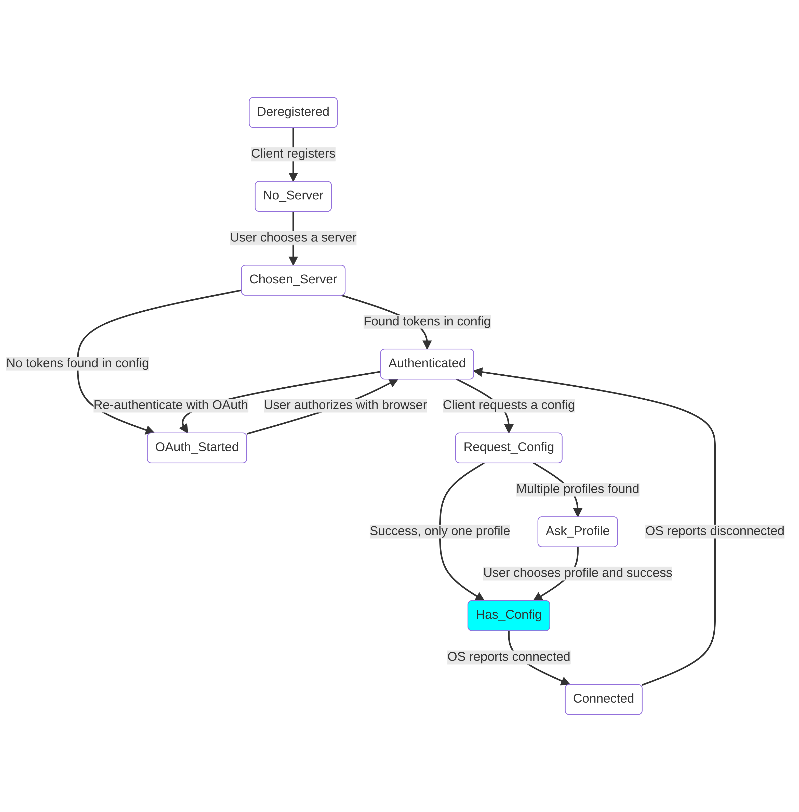

# Finite State Machine

The eduvpn-common library uses a Finite State Machine internally to keep track of which state the client is in and to communicate data callbacks(e.g. to communicate the Authorization URL in the OAuth process to the client).

## Viewing the FSM
To view the FSM in an image, set the debug variable to `True`. This outputs the graph with a `.graph` extension in the client-specified config directory (See [API](../../api/index.html)). The format of this graph is from [Mermaid](https://mermaid-js.github.io/mermaid/#/).

If you have the [Mermaid command line client](https://github.com/mermaid-js/mermaid-cli) installed, the Go library will automatically provide a PNG file in the same directory of the `.graph` file. We recommend to use an image viewer that has auto-reload capabilities, such as [feh](https://feh.finalrewind.org/)[^1] for Linux.

## FSM Example
The following is an example of the FSM when the client has obtained a Wireguard/OpenVPN configuration from an eduVPN server

The current state is highlighted in the cyan color.

## State explanation
The states mean the following:

- `DEREGISTERED`: The client has not registered with the library yet, the state variables are not initialized
- `NO_SERVER`: The client is registered, but has not chosen a server yet
- `CHOSEN_SERVER`: The client has chosen a server to connect to
- `OAuth_Started`: The OAuth process has been started. This means that the client needs to redirect to the browser so that the user can login and approve the application
- `Authenticated`: The OAuth process has finished. The client now has tokens and is thus authenticated
- `Request_Config`: The client is in the process of requesting an OpenVPN/Wireguard configuration from the server
- `Ask_Profile`: The server has multiple profiles for which a config can be obtained, the client must show an UI of the profiles. The user then selects one of these profiles to exit this state
- `Has_Config`: The client now has a configuration that it can use to connect using OpenVPN/Wireguard
- `Connected`: The client is connected to the VPN

[^1]: We recommend the following arguments for feh: `feh --auto-reload --keep-zoom-vp directory/example.png`. This auto reloads the feh image viewer and keeps the zoom level when reloading
