# Finite state machine

The eduvpn-common library uses a finite state machine internally to keep track of which state the client is in and to communicate data callbacks (e.g. to communicate the Authorization URL in the OAuth process to the client).

## Viewing the FSM
To view the FSM in an image, set the debug variable to `True`. This
outputs the graph with a `.graph` extension in the client-specified
config directory (See [API](../../api/index.html)). The format of this
graph is from [Mermaid](https://mermaid-js.github.io/mermaid/#/). You
can convert this to an image using the [Mermaid command-line client](https://github.com/mermaid-js/mermaid-cli) installed or from the Mermaid web site, the [Mermaid Live Editor](https://mermaid.live)

## FSM example
The following is an example of the FSM when the client has obtained a Wireguard/OpenVPN configuration from an eduVPN server

The current state is highlighted in the cyan color.

## State explanation

For the explanation of what all the different states mean, see the [API documentation](/api/overview/index.md#states)
